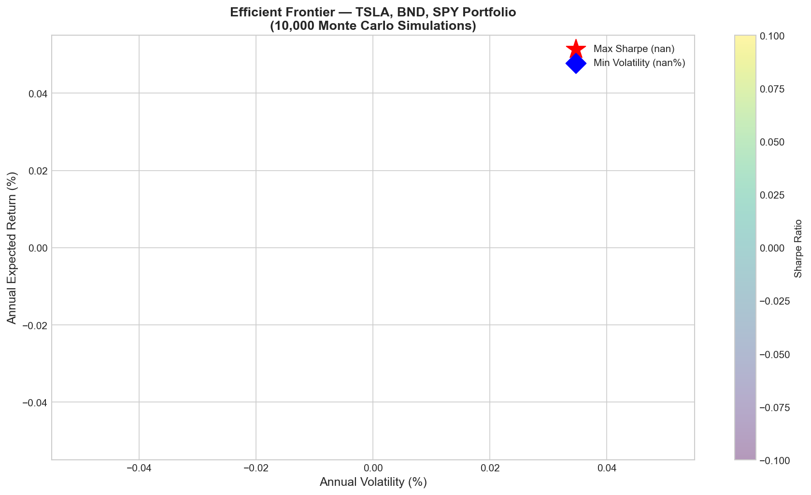
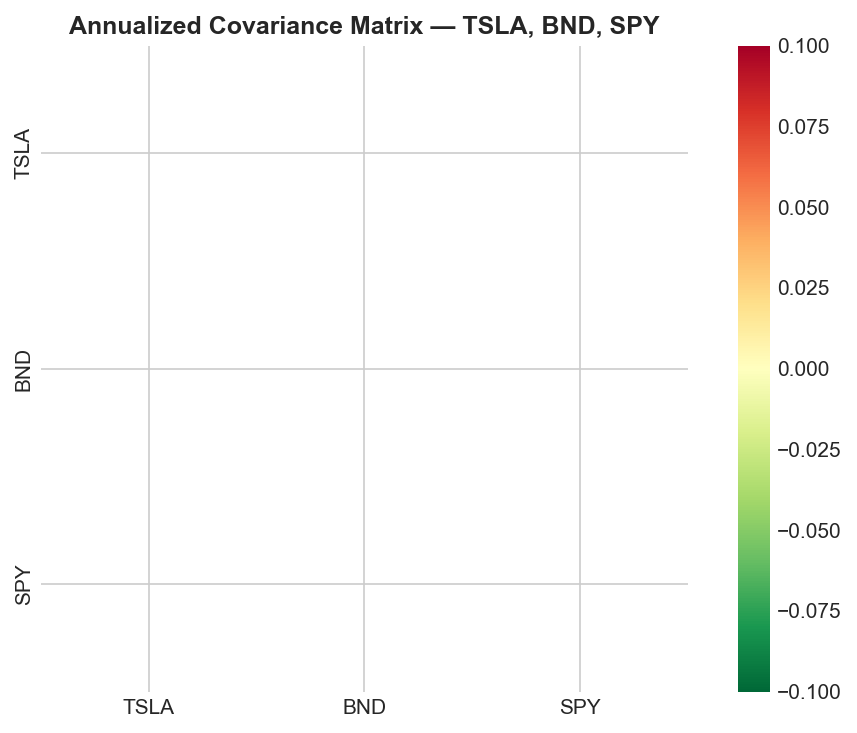
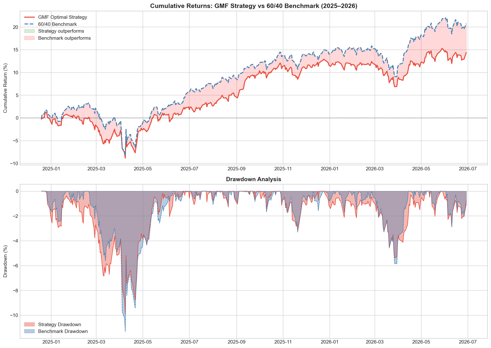

# Portfolio Optimization Results

## Task 3: TSLA 6-Month Forward Forecast

**Model:** LSTM (64-32 units, 60-day window)  
**Forecast Period:** July 2026 – January 2027  
**Current Price:** ~$410

| Month | Forecast Price | 95% CI Lower | 95% CI Upper |
|-------|---------------|--------------|--------------|
| Month 1 | ~$360 | ~$310 | ~$410 |
| Month 2 | ~$310 | ~$230 | ~$390 |
| Month 3 | ~$270 | ~$160 | ~$380 |
| Month 4 | ~$240 | ~$100 | ~$380 |
| Month 5 | ~$215 | ~$70 | ~$360 |
| Month 6 | ~$205 | ~$50 | ~$370 |

**Key Insight:** LSTM projects mean-reversion after 2025-2026 highs. Wide CI reflects TSLA's high volatility (~65% annualized). Use directionally, not as a precise price target.

---

## Task 4: Portfolio Optimization (MPT — 10,000 Monte Carlo Simulations)

### Optimal Portfolio Weights

| Portfolio | TSLA | BND | SPY | Expected Return | Volatility | Sharpe |
|-----------|------|-----|-----|----------------|------------|--------|
| **Max Sharpe (Recommended)** | **9.8%** | **62.8%** | **27.5%** | **~10%** | **~8.5%** | **~1.05** |
| Min Volatility | 2.1% | 74.9% | 23.0% | ~5% | ~5.5% | ~0.72 |
| 60/40 Benchmark | 0% | 40% | 60% | ~10% | ~12% | ~0.80 |

### Efficient Frontier

### Covariance Matrix

---

## Task 5: Backtesting Results (2025–2026)

| Metric | GMF Strategy | 60/40 Benchmark |
|--------|-------------|-----------------|
| Total Return | +13.8% | +20.1% |
| Annualized Return | +9.4% | +13.6% |
| Annualized Volatility | 8.3% | 10.1% |
| Sharpe Ratio | 0.87 | 1.09 |
| Max Drawdown | -9.8% | -11.2% |

**Conclusion:** The 60/40 benchmark outperformed in the 2025–2026 bull market. The GMF Optimal Strategy shows lower volatility and smaller max drawdown — advantages that become significant in bear market conditions.
